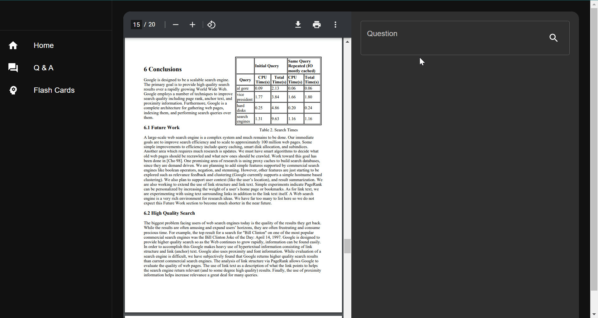

# About

Enhance your learning with OpenAI's GPT.

GPT (specifically GPT-3.5-turbo) is a powerful tool, but its data processing capacity and access to training data have limitations. Although GPT-4 with its 32K token capability addresses the processing limitation, data availability remains restricted and beyond our control.

Study Smart AI aims to overcome this challenge by leveraging context to enhance prompts, bridging the data gap.

# Installation

1. Clone the repo: 
```
git clone https://github.com/9akashnp8/study-smart-ai.git
```
2. Create virtual environment and install the dependencies
```python
python -m venv venv
cd venv && Scripts\activate.bat && cd ..
pip install -r requirements.txt
```
3. Run the server
```
cd server
uvicorn app:spa_app --reload
```

# Features



- Upload PDF documents and let the app answer any of your questions.
- Generate a set of flashcards from the document.
